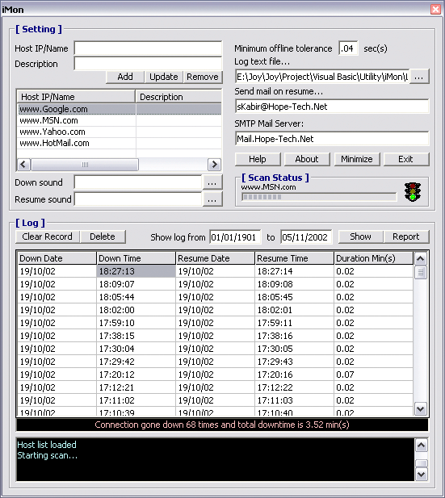



## A Internet Status Monitor & Logger which can even mail you to notify when you are back online\! iMon

### Description

This is also like the other one that monitors if you are Online or Offline and keeps track of it. It can also notify you via email whenever you get back to Online.
 
### More Info
 

             |
---                |---
**Submitted On**   |2002-11-05 18:20:48
**By**             |[Broken Arrow](https://github.com/Planet-Source-Code/PSCIndex/blob/master/ByAuthor/broken-arrow.md)
**Level**          |Intermediate
**User Rating**    |4.3 (17 globes from 4 users)
**Compatibility**  |VB 6\.0
**Category**       |[Complete Applications](https://github.com/Planet-Source-Code/PSCIndex/blob/master/ByCategory/complete-applications__1-27.md)
**World**          |[Visual Basic](https://github.com/Planet-Source-Code/PSCIndex/blob/master/ByWorld/visual-basic.md)
**Archive File**   |[iMon1492281152002\.zip](https://github.com/Planet-Source-Code/broken-arrow-a-internet-status-monitor-logger-which-can-even-mail-you-to-notify-when-you-a__1-40428/archive/master.zip)

